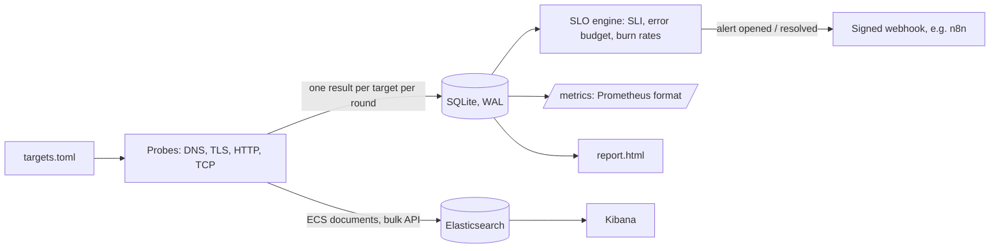

# Architecture

## Flow

| Module | Responsibility |
|---|---|
| `config.py` | Load the TOML file, validate every target (names, kinds, SLO range, unknown keys). |
| `probes.py` | The four probes. Each returns a `ProbeResult`; network errors become failed results, never exceptions. |
| `store.py` | SQLite schema and queries: counts per window, daily aggregates, latency percentiles, alert state. |
| `slo.py` | SLI, error budget, burn rate, the three alert rules and their open/resolve transitions. |
| `exporters.py` | ECS documents and the Elasticsearch bulk API, Prometheus text format, HMAC-signed webhooks. |
| `report.py` | Self-contained HTML report (light and dark mode, no external assets). |
| `simulate.py` | 30 days of fictional data with three incidents, and a fast replay of the alert rules over it. |
| `cli.py` | `demo`, `probe`, `run`, `report`, `metrics`, `check-config`. |

## What counts as good

Each probe is one event. An event is **good** when the probe succeeded and, if the target has a latency objective, it was fast enough:

| Kind | Succeeds when |
|---|---|
| `dns` | The system resolver returns at least one address within the timeout. |
| `tls` | TCP connect, TLS handshake, chain and hostname validation pass, and the certificate is valid for more than `tls_critical_days`. |
| `http` | The response arrives within the timeout with the expected status code. |
| `tcp` | A TCP connection opens within the timeout. |

The SLI is `good / total` over the SLO window (30 days by default). The error budget is `1 - SLO`: with 99.9 % and one probe per minute, about 43 bad probes a month.

## Burn rate and alerts

Burn rate is the observed error rate divided by the error rate the SLO allows. At 1 the budget lasts exactly the window; at 14.4 it is gone in about two days.

| Rule | Long window | Short window | Burn rate | Min. bad probes | Action |
|---|---|---|---|---|---|
| `page-fast` | 1 h | 5 min | 14.4 | 3 | Page |
| `page-slow` | 6 h | 30 min | 6 | 5 | Page |
| `ticket` | 3 days | 6 h | 1 | 10 | Ticket |

Both windows must exceed the threshold. The long window gives confidence that the problem is real; the short window makes the alert resolve soon after the fix. Thresholds follow the multi-window, multi-burn-rate approach described in Google's *Site Reliability Workbook* ("Alerting on SLOs"). The minimum number of bad probes is this project's addition, explained in [docs/decisions.md](docs/decisions.md).

Alert state lives in the `alerts` table, so each transition (opened, resolved) is sent once, even across restarts.

## Data model

| Table | Columns |
|---|---|
| `probes` | `ts`, `target`, `kind`, `ok`, `good`, `latency_ms`, `detail`, `extra` (JSON: addresses, status code, TLS days left) |
| `alerts` | `target`, `rule`, `severity`, `opened_ts`, `closed_ts`, burn rates at opening |

`run` deletes probes older than the SLO window plus three days.

## Elasticsearch documents

Probes are shipped with the bulk API as ECS-style documents, so they line up with other Elastic data:

| Field | Example |
|---|---|
| `@timestamp` | `2026-09-22T01:04:12Z` |
| `event.outcome` / `event.duration` | `failure` / `4512000000` (nanoseconds) |
| `service.name` | `public-api-dns` |
| `destination.domain`, `destination.port` or `url.full` | `api.example.com` |
| `http.response.status_code`, `tls.server.not_after_days` | when the probe has them |
| `edge.probe.kind`, `edge.probe.good`, `edge.probe.latency_ms`, `edge.probe.slo_target` | custom fields for the SLO |
| `labels.*` | the target's `tags` |

The index template in [`deploy/elasticsearch/index-template.json`](deploy/elasticsearch/index-template.json) maps these fields.
